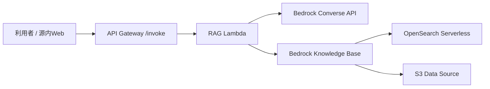

# 源内OSS調査メモ

調査日: 2026-05-09

目的は、デジタル庁の源内OSSを「地方議員向けのRAG型AI調査アシスタント」として小さく検証できるか判断すること。最初から市民公開サービスにせず、自分用・検証用として千歳市の公開行政資料を読み込ませる前提で整理する。

## 結論

源内OSSはPoC候補として有望。ただし、最初にフル構成の源内Webを本番運用するより、まず `genai-ai-api` の AWS Query Expansion RAG API を単体で検証し、curlまたは簡易UIで回答品質・引用品質・AWS費用を確認するのがよい。

理由は3つ。

- RAGテンプレート側に、クエリ拡張、Bedrock Knowledge Base検索、関連性評価、回答生成、参考情報表示まで一通り揃っている。
- 源内Webはログイン、チーム管理、AIアプリ登録、外部AIアプリ呼び出しまで備えるが、PoC初期には少し重い。
- OpenSearch ServerlessやBedrock利用料は、使っていない時間にも一定の費用要因が残る可能性があるため、先に最小構成で費用感をつかむべき。

## 対象リポジトリ

| リポジトリ | 役割 | PoCでの位置づけ |
|---|---|---|
| `digital-go-jp/genai-web` | 利用者が触るAIインターフェース。認証、チャット、文章生成、翻訳、画像生成、チーム管理、AIアプリ登録を持つ | 2段階目。RAG APIの品質確認後に接続する候補 |
| `digital-go-jp/genai-ai-api` | 源内Webから呼び出せる行政実務用AIアプリ集 | 1段階目。AWS Query Expansion RAGを最優先で検証 |

源内WebのREADMEでは、源内は行政職員が業務特化の生成AIアプリケーションを安全・簡単に利用する基盤と説明され、AWSのGenerative AI Use Casesをベースに、チーム管理、AIアプリ管理、外部マイクロサービス実行、デジタル庁デザインシステム適用などが追加されている。

genai-ai-apiのREADMEでは、源内Webと連携する行政実務用AIアプリを公開しており、AWS向けに「行政実務用RAG（検索拡張生成）の開発テンプレート」が用意されている。

## genai-webの構成

主な構成は次の通り。

| 領域 | 内容 |
|---|---|
| `packages/web` | Vite + Reactのフロントエンド |
| `packages/cdk` | AWS CDK。認証、API、Web配信、チーム管理、監視などをデプロイ |
| `docs/` | 事前準備、デプロイ、アカウント登録、AIアプリ登録、API仕様、SAML、運用など |
| `scripts/setup-env.sh` | CloudFormation Outputsからローカル開発用の `VITE_APP_*` を取得 |
| `scripts/run.sh` | 指定したCDK環境名でローカルWebを起動 |

源内Web単体で使える汎用AIアプリは、チャット、文章生成、翻訳、画像生成、ダイアグラム生成。今回のRAG PoCで重要なのは、外部の「行政実務用AIアプリ」を登録して、チーム単位で利用できる仕組み。

## genai-ai-apiの構成

公開されているAIアプリはクラウド別に分かれている。

| クラウド | パス | 内容 |
|---|---|---|
| AWS | `aws/query-expansion-rag` | Bedrock Knowledge Baseを使うクエリ拡張RAG API |
| Azure | `azure/genai-azure` | LLMをセルフデプロイして利用するテンプレート |
| Google Cloud | `google-cloud/lawsy-custom-bq` | 法令条文データ参照AIアプリ |

今回の主対象は `aws/query-expansion-rag`。

## Query Expansion RAGの構成

README上の主な構成は次の通り。

処理の流れはおおむね以下。

1. `inputs.question` を受け取る
2. LLMで複数の検索クエリに拡張する
3. Bedrock Knowledge Baseに対して複数クエリで検索・生成する
4. 取得した抜粋を関連性評価する
5. 上位引用を文脈として回答を生成する
6. 回答末尾に生成AI注意書きと参考情報を付ける

参考情報は `file_name`、`url`、ページ番号を使ってMarkdownリンクとして出せる。これは「根拠資料への引用を必ずつける」要件と相性がよい。

## RAGテンプレートで重要な設定

| 設定 | 場所 | 意味 |
|---|---|---|
| アプリ定義 | `config/apps/*.toml` | アプリ名、説明、回答フッター、プロンプト、モデル設定 |
| デフォルト設定 | `config/defaults/*.toml` | クエリ拡張、検索生成、関連性評価、回答生成の初期値 |
| デプロイ対象 | `cdk.json` / `parameter.ts` | どのRAGアプリをどの環境に出すか |
| 埋め込みモデル | `embeddingModelId` | 初期値は `amazon.titan-embed-text-v2:0` |
| 検索件数 | Lambda環境変数 `KB_NUM_RESULTS` | 初期値は20 |
| API制限 | API Gateway usage plan | 1日1000リクエストのquotaが定義されている |
| IP制限 | `allowedIpV4AddressRanges` など | WAFで送信元を絞れる |
| メタデータ | `*.metadata.json` | ファイル名、URL、タグなどを検索・引用に使える |

## 千歳市RAGに使えるポイント

- `config/apps/chitose-policy-rag.toml` のような個別設定を作るだけで、プロンプトやモデルをPoC用に寄せられる。
- `tools/add_metadata_json` で、PDFやDOCXに対応するURLを `metadata.json` として付与できる。
- `inputs.tags` でメタデータフィルタを使える実装があり、資料種別や年度で絞り込みできる可能性がある。
- 参考情報生成処理があるため、回答だけでなく「どの資料のどこを根拠にしたか」を出しやすい。

## 注意が必要な点

- READMEの主導線はOpenSearch Serverlessバックエンド。小規模PoCでもOpenSearch Serverlessの最低OCU課金が費用要因になりやすい。
- コード上はS3 Vectorsバックエンド用スタックもあるが、READMEの主手順ではない。リージョン対応、料金、安定性は実デプロイ前に確認する。
- `allowedIpV4AddressRanges` のサンプルが `0.0.0.0/0` なので、そのまま使わず自宅・事務所など必要なIPに絞る。
- デフォルトプロンプトは「社内規約・利用マニュアル」向け。千歳市公開資料向けに必ず置き換える。
- `output_in_detail` を安易に常用すると、詳細回答モデルと長い出力で費用が膨らむ。

## 推奨する進め方

1. AWS検証アカウントまたは明確にタグ分けした検証環境を用意する
2. AWS BudgetsとCost Anomaly Detectionを先に設定する
3. `genai-ai-api/aws/query-expansion-rag` を単体で1アプリだけデプロイする
4. 千歳市公開資料を10〜30件だけS3に入れ、メタデータURLを付ける
5. Knowledge Base同期後、`curl` で20問程度の実務質問を試す
6. 回答、引用、誤回答、費用を見て、源内Web接続に進むか判断する

## 参考資料

- [digital-go-jp/genai-web](https://github.com/digital-go-jp/genai-web)
- [digital-go-jp/genai-ai-api](https://github.com/digital-go-jp/genai-ai-api)
- [genai-ai-api: AWS Query Expansion RAG](https://github.com/digital-go-jp/genai-ai-api/tree/main/aws/query-expansion-rag)
- [Amazon Bedrock Pricing](https://aws.amazon.com/bedrock/pricing)
- [Amazon OpenSearch Service Pricing](https://aws.amazon.com/opensearch-service/pricing/)
- [Amazon Bedrock Knowledge Bases: S3 data source](https://docs.aws.amazon.com/bedrock/latest/userguide/s3-data-source-connector.html)
