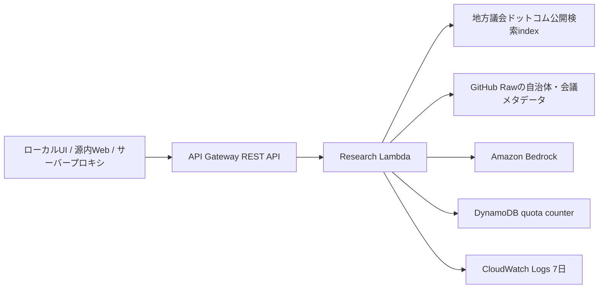

# 北海道・議会政策AIリサーチャー API

北海道内の地方議会議事録を既存の地方議会ドットコム検索データから探し、一次資料の根拠を保ったままAmazon Bedrockで論点整理するMVPです。

これは既存サイトとは独立した実証用サービスです。`site/` のNext.js・OpenNext・Cloudflare Workers配信をAWSへ移すものではありません。AWS側が停止しても地方議会ドットコムの通常閲覧・検索は影響を受けません。

## 現在の検証環境

2026年8月13日時点:

- CloudFormation stackは`UPDATE_COMPLETE`。
- API Gateway検証URLは`https://vhh2sovev0.execute-api.ap-northeast-1.amazonaws.com/dev`。
- 固定3ケースはHTTP 200で、議事録検索・根拠抽出まで確認済み。
- API keyはAWS側の非公開情報として管理し、リポジトリには保存しない。
- Bedrock Nova 2 Liteは、このAWSアカウントの推論クォータが0のため呼出待ち。検索結果は返し、AI要約だけ定型fallbackになる。
- 既定クォータへの復元申請はAWSサポートで確認中。ケース番号はリポジトリへ記録しない。
- `/research`との接続とCloudflare限定公開は、Bedrock再テスト後にstagingから行う。

## 構成



MVPのAWSリソースはRegional REST API、Lambda、DynamoDB on-demand表、CloudWatch Logsだけです。Bedrockは指定モデルを従量利用します。VPC、NAT Gateway、S3、Bedrock Knowledge Bases、OpenSearch Serverless、RDS、Neptuneは作りません。

## API

### 通常REST API

`POST /research`

```json
{
  "query": "千歳市、恵庭市、苫小牧市の不登校支援に関する議会議論を比較してください。",
  "municipalities": ["chitose", "eniwa", "tomakomai"],
  "sourceTypes": ["plenary_minutes"],
  "fiscalYears": [2024, 2025, 2026],
  "mode": "comparison"
}
```

`mode` は `research`、`comparison`、`question_prep` のいずれかです。レスポンスは構造化された調査結果、根拠、citation検証結果、AI使用量、調査上の限界を含みます。

### 源内Web互換API

`POST /invoke`

源内Webの公式仕様に従い、入力は `inputs` で包みます。

```json
{
  "inputs": {
    "question": "学校給食費無償化について北海道内自治体ではどんな議論がありますか？",
    "municipalities": "chitose,eniwa,tomakomai",
    "fiscal_years": "2024,2025,2026",
    "mode": "comparison"
  }
}
```

`question` だけが必須です。`municipalities` は自治体slug、`fiscal_years` は西暦年度をそれぞれ半角カンマ区切りで指定する任意項目です。`mode` も任意で、`research`（調査）、`comparison`（自治体比較）、`question_prep`（議会質問準備）から選び、省略時は `research` になります。空欄または省略した絞り込み項目は検索範囲を限定しません。

同期レスポンスの `outputs` は、源内Webが表示できるMarkdown文字列です。

```json
{
  "outputs": "# 調査概要\n\n...\n\n## 根拠資料\n..."
}
```

源内Webの「リクエスト形式」には [`config/genai-request-definition.json`](config/genai-request-definition.json) を登録します。API endpointはstack outputの `GenaiEndpoint`、API keyは後述の手順で取得した値を設定します。

仕様の基準はデジタル庁源内の[AIアプリAPI仕様](https://github.com/digital-go-jp/genai-web/blob/main/docs/AI%E3%82%A2%E3%83%97%E3%83%AAAPI%E4%BB%95%E6%A7%98.md)です。仕様は変更され得るため、源内接続前に最新版を確認してください。

2026年8月12日時点では、公式の2026年3月版仕様にある同期APIの `inputs` リクエストと `outputs` レスポンスに適合しています。`test/api-contract.test.ts` で通常REST、源内同期API、Lambda入口、リクエスト形式定義を一体で検証します。

## ローカル起動

前提はNode.js 22とnpmです。

```bash
cd research-api
npm install
cp .env.example .env
npm run dev
```

既定URLは `http://localhost:8788` です。`.env` の `BEDROCK_MODEL_ID` を空にすると、AWS認証情報なしで検索結果fallbackを確認できます。ローカルAPI keyを使う場合だけ `LOCAL_API_KEY` を設定します。

```bash
curl -X POST http://localhost:8788/research \
  -H 'Content-Type: application/json' \
  -d '{"query":"学校給食費無償化","mode":"research"}'
```

検証:

```bash
npm run lint
npm run typecheck
npm test
npm run build
```

## 環境変数

正式な一覧とローカル既定値は [`.env.example`](.env.example) を参照してください。主な設定は次のとおりです。

| 変数 | 用途 |
|---|---|
| `AI_ENABLED` | `false` で検索APIを残したままBedrock呼出だけを停止 |
| `BEDROCK_MODEL_ID` | 使用するfoundation modelまたはinference profileのID |
| `BEDROCK_MAX_OUTPUT_TOKENS` | 1回のAI出力上限 |
| `BEDROCK_TIMEOUT_MS` | Bedrock呼出のtimeout。既定9,000ms、上限10,000ms |
| `GIKAI_SEARCH_INDEX_URL` | 全期間の公開検索index |
| `GIKAI_CITY_INDEX_BASE_URL` | 市町村別公開検索indexのbase URL |
| `GIKAI_DATA_RAW_BASE_URL` | 自治体台帳・会議indexのGitHub Raw base URL |
| `GIKAI_FETCH_TIMEOUT_MS` | 公開検索index・メタデータ取得のtimeout。既定・上限5,000ms |
| `MAX_RESULTS_PER_SEARCH` | 検索候補数の上限 |
| `MAX_EVIDENCE_ITEMS` | AIへ渡す根拠数の上限 |
| `MAX_EVIDENCE_CHARS` | AIへ渡す根拠文字数の上限 |
| `MAX_LLM_CALLS_PER_REQUEST` | 1リクエストのLLM呼出上限 |
| `MAX_DAILY_REQUESTS` | アプリ側の日次上限 |
| `MAX_MONTHLY_REQUESTS` | アプリ側の月次上限 |
| `USAGE_TABLE_NAME` | SAMがLambdaへ設定するquota表名 |
| `DEBUG_RESEARCH` | 明示的なデバッグ有効化。生の質問・本文は出力しない |

AWSではアクセスキーを環境変数に置きません。Lambda execution roleを使用します。API key値、AWS access key、secret access keyをcommitしないでください。ブラウザへAPI keyを渡すことも避け、公開UIから接続する場合はサーバー側のproxy/secretを使います。

## SAMの静的検証

AWS SAM CLIを別途インストールした環境で実行します。これらのコマンドはAWSリソースを作りません。

```bash
cd research-api
sam validate --lint --template-file infra/template.yaml
sam build --template-file infra/template.yaml
npm run sam:smoke
```

`sam:smoke` はSAM生成bundleを別の一時ディレクトリからCommonJSとして直接読み込み、ローカル生成索引でLambda handlerを実行します。Dockerは不要で、AWSリソースやBedrockを呼び出しません。

SAM CLIがない環境では、CloudFormation/SAMスキーマの先行確認だけを `cfn-lint -r ap-northeast-1 -t infra/template.yaml` で行えます。ただし、これは `sam build` の代替ではありません。

通常のローカル検証コマンドは、AWSへのdeploy、stack変更、Bedrock呼出を行いません。外部反映は対象アカウントと実行内容を確認し、明示的にdeployするときだけ行います。

## 固定3ケースのスモーク

ローカルAPIまたはdeploy後の検証用APIに対して、学校給食、不登校支援の3市比較、生成AI・自治体DXの3ケースを同じコマンドで確認します。HTTP 200、免責、根拠URL・抜粋、AI状態、比較対象で根拠がない自治体の明示を検査します。

```bash
# ローカル（既定 http://127.0.0.1:8788）
RESEARCH_API_KEY='local key when configured' npm run smoke

# AWS検証環境
RESEARCH_API_BASE_URL='https://example.execute-api.ap-northeast-1.amazonaws.com/dev' \
RESEARCH_API_KEY='<API_KEY>' \
npm run smoke
```

API keyはコマンド履歴へ残さない運用を推奨します。上記は変数名と呼出方法の例で、実値をリポジトリへ保存しません。

## AWSへdeployする場合

実際に検証環境を作ると判断した場合だけ実行します。

事前条件:

1. 検証専用または明確にタグ分けしたAWSアカウントを決める。
2. AWS CLIとSAM CLIを用意し、`aws sts get-caller-identity` で対象アカウントを確認する。
3. 原則 `ap-northeast-1` を使い、Bedrock modelの利用可否を確認する。
4. 後述のAWS BudgetとCost Anomaly Detectionを先に設定する。
5. foundation modelを直接呼ぶ場合はそのmodel ARN、inference profileを使う場合はprofile ARNと全backing foundation model ARNを確認する。

2026年8月時点の初回検証候補は `jp.amazon.nova-2-lite-v1:0` です。AWS公式ではNova 2 LiteはactiveでConverse APIに対応し、東京からJP geo inferenceを使う場合の処理先は東京・大阪です。固定採用ではなく、deploy直前に[model card](https://docs.aws.amazon.com/bedrock/latest/userguide/model-card-amazon-nova-2-lite.html)と[料金表](https://aws.amazon.com/bedrock/pricing/)を再確認し、実アカウントで固定3ケースの日本語品質・latency・token費用を測ってから確定します。

認証後は次の読み取り専用preflightで、呼出先アカウント、東京リージョンのBedrock model、inference profileと全backing modelを含むwildcardなしの許可ARN、既存AWS Budgetをまとめて確認できます。このコマンドはリソースを作成・変更しません。不足ARNはAWS APIが返した実値を表示します。

```bash
AWS_PROFILE='<検証用profile>' \
AWS_REGION='ap-northeast-1' \
BEDROCK_MODEL_ID='<MODEL_ID_OR_INFERENCE_PROFILE_ID>' \
ALLOWED_BEDROCK_MODEL_ARNS='<EXACT_ARN_OR_COMMA_SEPARATED_ARNS>' \
npm run aws:preflight
```

```bash
cd research-api
sam build --template-file infra/template.yaml
sam deploy --guided \
  --parameter-overrides \
    BedrockModelId='<MODEL_ID>' \
    AllowedBedrockModelArns='<EXACT_MODEL_ARN_OR_COMMA_SEPARATED_ARNS>'
```

`AllowedBedrockModelArns` はLambda roleの `bedrock:InvokeModel` を必要なmodelだけに制限します。inference profileは関連するfoundation model ARNも許可する必要があります。モデルID、利用可能リージョン、関連ARNはdeploy直前にBedrockの現行ドキュメント・consoleで確認してください。

検索APIを残したままAIだけを停止する場合は、次回のSAM deployで `AiEnabled=false` を指定します。再開時は `true` に戻します。AI停止中も関連議事録と根拠カードはfallbackとして返ります。

### Cloudflare UIとの接続

UIを接続すると決めた段階で、まずCloudflare Worker `chihougikai-com-staging` に上流APIのURL・keyと、限定公開用のpassword・session secretをserver-side secretとして設定します。staging確認後に本番Workerへ進む場合も、値を `NEXT_PUBLIC_` 変数やリポジトリへ置かないでください。passwordは12文字以上、session secretは別途生成した32文字以上のランダム値を使います。

```bash
cd site
npx wrangler secret put POLICY_RESEARCH_API_URL --name chihougikai-com-staging
npx wrangler secret put POLICY_RESEARCH_API_KEY --name chihougikai-com-staging
npx wrangler secret put POLICY_RESEARCH_ACCESS_PASSWORD --name chihougikai-com-staging
npx wrangler secret put POLICY_RESEARCH_SESSION_SECRET --name chihougikai-com-staging
```

`/research` と `/api/research` は、passwordまたはsession secretが未設定・短すぎる場合に利用を拒否します。passwordを変更すると既存の12時間sessionも無効になります。

ログイン試行回数のアプリ内制限はWorker process内の補助策です。本番でインターネット公開する前に、Cloudflare WAF / Rate LimitingまたはKV・Durable Object等の共有カウンタを追加し、十分に長いランダムpasswordと併用してください。

現在のdeploy scriptはdashboard側の変数を保持する `--keep-vars` を明示していません。本番接続前に既存Cloudflare deploy runbookと整合を確認し、secret保持をstagingで検証してから変更・deployしてください。本MVP実装では設定・deployを行いません。

stack outputのAPI key IDから値を取得します。値はCloudFormation outputやログへ保存しません。

```bash
STACK_NAME='<SAM_STACK_NAME>'
API_KEY_ID=$(aws cloudformation describe-stacks \
  --stack-name "$STACK_NAME" \
  --query 'Stacks[0].Outputs[?OutputKey==`ApiKeyId`].OutputValue' \
  --output text)
aws apigateway get-api-key \
  --api-key "$API_KEY_ID" \
  --include-value \
  --query value \
  --output text
```

API Gateway API keyは利用量識別子であり、強い認証・認可ではありません。MVPは本人用・閉じた検証に限定します。公開や複数利用者運用の前にはIAM、CognitoまたはLambda authorizerを追加してください。

## コストガード

目標は月額5,000円以内ですが、為替とBedrock単価は変動するため金額をコードに固定しません。

- API Gateway Usage Plan: 月500リクエスト、rate 1 request/秒、burst 2
- DynamoDB: 日50・月500をアプリ側で検査するon-demand quota表
- Lambda: reserved concurrency 2、512MB、timeout 28秒
- Bedrock: 1リクエスト最大2回、1回9秒timeout（上限10秒）、根拠8件・30,000文字、出力3,000 token
- 取得時間: 自治体台帳と検索indexを並列取得し、その後の会議index取得も含め各段階5秒で中断するため、Bedrock timeout後のfallback処理時間をLambda全体28秒の中に残す
- 同一質問: 短時間のメモリcache。質問文をquota表へ保存しない
- CloudWatch Logs: 7日で自動削除
- S3、OpenSearch Serverless、NAT Gatewayなどの固定費要因は不使用

API Gatewayのquota/throttleはbest effortであり、完全な停止装置ではありません。DynamoDB quota、Lambda同時実行上限、アプリ内の文字数・token・呼出回数上限を併用します。

レスポンスmetadataと構造化ログには、利用可能な場合にinput/output token数と推定USDを残します。推定額を出す場合だけ、現在の公式料金を確認して `BEDROCK_INPUT_COST_PER_MILLION_TOKENS` と `BEDROCK_OUTPUT_COST_PER_MILLION_TOKENS` を設定します。

## AWS Budget設定

Budgetはアプリstackと分け、deploy前にAWS Billing and Cost Managementで設定します。

1. Cost Budgetを月次で作成する。
2. 5,000円を現在のAWS請求通貨へ保守的に換算し、それ以下の金額を上限にする。
3. Actual 50%、80%、100%とForecasted 80%のメール通知を設定する。
4. 通知メールを確認し、Cost Anomaly Detectionも有効にする。
5. 検証中はCost ExplorerでBedrock、Lambda、API Gateway、DynamoDB、CloudWatchを毎日確認する。

Budgetは通知であり、即時のhard stopではありません。請求データと通知には遅延があるため、異常時は次の停止操作を行います。

## 緊急停止・削除

最速の停止はLambda reserved concurrencyを0にする方法です。

```bash
FUNCTION_NAME=$(aws cloudformation describe-stacks \
  --stack-name "$STACK_NAME" \
  --query 'Stacks[0].Outputs[?OutputKey==`FunctionName`].OutputValue' \
  --output text)
aws lambda put-function-concurrency \
  --function-name "$FUNCTION_NAME" \
  --reserved-concurrent-executions 0
```

再開時の既定値は2です。

```bash
aws lambda put-function-concurrency \
  --function-name "$FUNCTION_NAME" \
  --reserved-concurrent-executions 2
```

検証終了後:

```bash
sam delete --stack-name "$STACK_NAME"
```

削除後、API Gateway、Lambda、DynamoDB table、CloudWatch LogGroup、IAM roleが残っていないことを確認します。翌日以降もCost Explorerで費用増加が止まったか確認してください。BudgetとCost Anomaly Detectionは継続監視に使う場合は残します。

## プライバシーとログ

- 質問文、議事録全文、AIへのprompt、回答全文をCloudWatch Logsへ出しません。
- ログはrequest ID、処理時間、検索件数、根拠件数・文字数、token量、推定費用、fallback理由を中心にします。
- DynamoDBには日次・月次counterと期限だけを置き、質問文は保存しません。
- `DEBUG_RESEARCH=true` でも質問・根拠本文の全量ログは禁止です。
- 公開資料だけを検索対象にし、質問にも個人情報・市民相談・未公開資料を入力しないでください。

## 調査上の限界

- 収録済み資料だけが検索対象です。検索結果がないことは、議会で議論がなかったことを意味しません。
- MVPの本実装は本会議議事録です。委員会、行政計画、予算、決算は未実装またはstubです。
- AIが停止・timeout・権限不足の場合は、AI分析なしで関連議事録検索結果を返します。
- 引用はAIへ渡したevidence IDだけを許可しますが、政策判断や正式な引用の前に自治体公式原文を確認してください。
- 全期間の横断indexは大きいためcold start時の取得時間が増える場合があります。
- API Gateway/Lambdaの同期MVPは28秒以内です。長時間調査が必要なら、将来は非同期APIを別設計します。
- AWS API keyだけで公開サービスを保護する設計ではありません。

すべての調査結果には次の注意を表示します。

> 本結果は地方議会.comに収録された公開資料を対象としたAIによる調査支援です。検索結果がないことは、当該議会で議論がなかったことを意味しません。政策判断や正式な引用にあたっては、リンク先の自治体公式資料・議事録原文を確認してください。

## ロードマップ

| Phase | 対象 |
|---|---|
| Phase 1 | 既存の本会議議事録とcitation検証 |
| Phase 2 | 常任委員会・特別委員会・予算委員会・決算委員会の議事録 |
| Phase 3 | 総合計画・総合戦略・個別行政計画 |
| Phase 4 | 予算・決算・事務事業評価の構造化データ |
| Phase 5 | 条例・組織・統計・オープンデータ |
| Phase 6 | 政策関係グラフと北海道内自治体比較 |

Phase 2では `CommitteeMinutesAdapter` を追加し、Phase 3では文書RAG adapterを追加します。S3やBedrock Knowledge Bases等を採用するかは、検索品質・地域対応・その時点の料金を再評価してから決め、OpenSearch Serverlessを必須依存にはしません。
